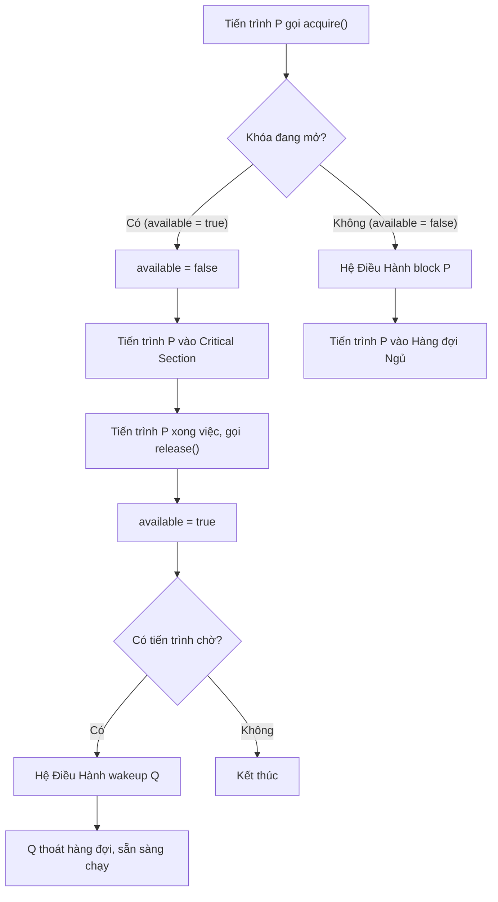

# BẢN ĐỒ TƯ DUY: HỆ ĐIỀU HÀNH - ĐỒNG BỘ TIẾN TRÌNH (CHƯƠNG 5.1)

## 1. Race Condition (Vùng tương tranh)
* **Bản chất:** Hiện tượng xảy ra khi nhiều tiến trình/tiểu trình cùng truy cập và thay đổi một dữ liệu dùng chung đồng thời.
* **Hậu quả:** Kết quả dữ liệu cuối cùng bị sai lệch, thiếu nhất quán (inconsistency), phụ thuộc hoàn toàn vào thứ tự lập lịch ngẫu nhiên của CPU.
* **Ví dụ:** Bài toán Producer tăng biến count và Consumer giảm biến count. Hoặc Bài toán cấp phát PID, khi P0 và P1 cùng gọi `fork()` và tranh chấp biến `next_available_pid` của Kernel.

## 2. Vấn đề Vùng tranh chấp (Critical Section Problem)
* **Critical Section (CS):** Là đoạn code mà ở đó các tiến trình thực hiện tác động lên dữ liệu được chia sẻ.
* **Tiêu chuẩn cho Lời giải Đồng bộ (3 yếu tố bắt buộc):**
    1.  **Mutual Exclusion (Loại trừ tương hỗ):** Khi tiến trình P đang thực thi trong CS thì không có tiến trình Q nào khác được thực thi trong CS của Q.
    2.  **Progress (Tiến triển):** Một tiến trình tạm dừng bên ngoài CS (Remainder Section) không được ngăn cản các tiến trình khác vào CS.
    3.  **Bounded Waiting (Chờ đợi giới hạn):** Mỗi tiến trình chỉ phải chờ để được vào CS trong một khoảng thời gian có hạn định, không để xảy ra tình trạng đói tài nguyên (starvation).

## 3. Các Giải pháp Phần mềm (Software Solutions)
* **Giải pháp 1 (Dùng biến `turn`):** Xác định tới lượt tiến trình nào được vào CS. Đảm bảo Mutual Exclusion nhưng **vi phạm Progress** do một tiến trình có thể bị treo nếu tiến trình kia không trả lượt.
* **Giải pháp 2 (Dùng mảng `flag`):** Dùng mảng cờ để xác định tiến trình đã sẵn sàng vào CS hay chưa.
* **Giải pháp Peterson:** Kết hợp cả biến `turn` (nhường lượt) và mảng `flag` (sẵn sàng). Lý thuyết hoàn hảo, đảm bảo cả 3 tiêu chuẩn. 
    * *Nhược điểm thực tế:* Dễ bị lỗi trên kiến trúc máy tính hiện đại vì CPU/Compiler có thể sắp xếp lại các thao tác độc lập (Reordering). Cần khắc phục bằng **Memory Barrier** để bắt buộc lan truyền thay đổi bộ nhớ.

## 4. Giải pháp Cơ chế Mutex Locks
* **Bản chất:** Hoạt động như một ổ khóa. Tiến trình gọi `acquire()` để khóa lại và tiến vào CS, sau đó gọi `release()` để mở khóa.
* **Phân loại Mutex:**
    * **Loại 1 - Spinlock (Busy Waiting):** Tiến trình liên tục lặp lại kiểm tra vòng lặp `while(!available)` để chờ, gây lãng phí CPU.
    * **Loại 2 - Sleep & Wakeup (Không Busy Waiting):** Hệ điều hành cung cấp cơ chế `block()` để đưa tiến trình vào trạng thái ngủ, và `wakeup()` để đánh thức khi khóa được mở.

### Sơ đồ Luồng hoạt động của Mutex Lock (Sleep & Wakeup)

