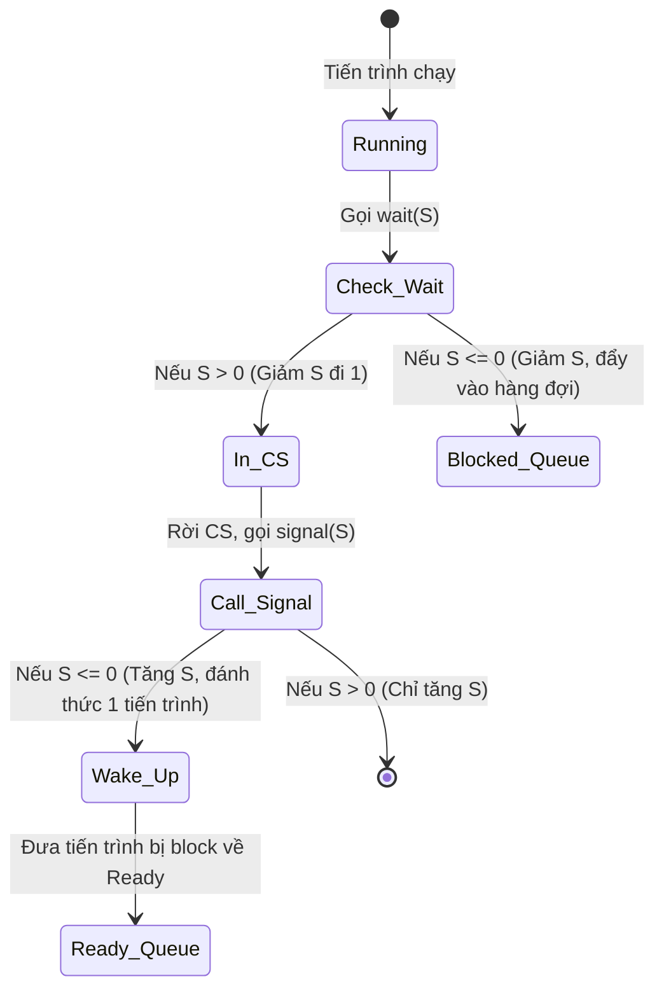

# CHƯƠNG 5: ĐỒNG BỘ TIẾN TRÌNH (PHẦN 2) - TỔNG HỢP

## 1. Bảng So Sánh Các Công Cụ Đồng Bộ

| Tiêu chí | Mutex Lock | Semaphore (Binary & Counting) | Monitor |
| :--- | :--- | :--- | :--- |
| **Bản chất** | Biến nhị phân (0, 1) | [cite_start]Biến số nguyên $S$ [cite: 37] | [cite_start]Kiểu dữ liệu trừu tượng (ADT) đóng gói các biến và hàm [cite: 421] |
| **Cơ chế hoạt động** | Khóa và Mở khóa vùng tranh chấp. | [cite_start]Đếm số tài nguyên qua `wait()` và `signal()`[cite: 39]. | [cite_start]Tự động bảo đảm loại trừ tương hỗ (chỉ 1 tiến trình vào monitor 1 thời điểm)[cite: 466]. |
| **Mức độ kiểm soát** | Cơ bản, dễ lỗi. | [cite_start]Linh hoạt, dùng cho nhiều bài toán (Mutual Exclusion, Đồng bộ thứ tự)[cite: 30]. | [cite_start]An toàn cao, do trình biên dịch hỗ trợ, lập trình viên ít bị lỗi sai thứ tự[cite: 415]. |
| **Condition Variable** | Không có. | Không có (dùng chính Semaphore để block). | [cite_start]Có (dùng `x.wait()` và `x.signal()` để đồng bộ theo điều kiện cụ thể)[cite: 472, 483, 484]. |

## 2. Mô hình Wait/Signal Queue của Semaphore (Không Busy Waiting)
Sự chuyển đổi trạng thái của tiến trình khi tương tác với Semaphore:

