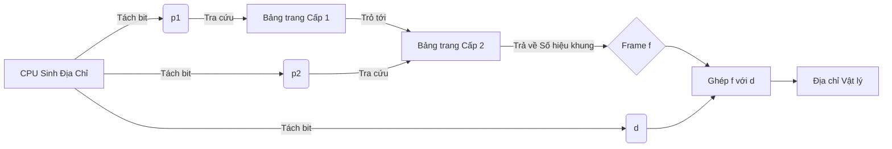

***

### 📄 FILE 2: TỔNG HỢP BÀI TẬP THỰC CHIẾN

# TUYỂN TẬP BÀI TẬP VÀ CẠM BẪY PHÂN TRANG

## BÀI 1: Bẫy cấu trúc Bit và Đổi đơn vị
**Đề bài:** Địa chỉ ảo 32-bit, RAM 8GB, Kích thước trang = 16KB. Tính số bit của offset $d$, số hiệu trang $p$, số hiệu khung $f$.
**Cách giải chuẩn:**
1. $d$: 16KB = $2^{14}$ bytes $\Rightarrow$ $d$ chiếm **14 bit**.
2. $p$: Địa chỉ ảo 32-bit $\Rightarrow p = 32 - 14 =$ **18 bit**.
3. Tổng bit vật lý: RAM 8GB = $2^{33}$ bytes $\Rightarrow$ Địa chỉ vật lý dài **33 bit**.
4. $f$: Bằng tổng bit vật lý trừ bit offset $\Rightarrow f = 33 - 14 =$ **19 bit**.

## BÀI 2: Dịch địa chỉ hệ Thập lục phân (Hex)
**Đề bài:** Kích thước trang = 4KB. Page 1 nằm ở Frame 9. Dịch địa chỉ ảo `0x1B4A` sang địa chỉ vật lý.
**Cách giải chuẩn:**
1. Phân tích offset: 4KB = $2^{12}$ bytes $\Rightarrow$ 12 bit offset tương đương 3 chữ số Hex cuối cùng.
2. Tách: $p = 1$, $d = \text{B4A}$.
3. Ánh xạ: Tra bảng thấy $p=1$ tương ứng $f=9$.
4. Ghép: Nối $f$ và $d$ lại $\Rightarrow$ Địa chỉ vật lý là **`0x9B4A`**.

## BÀI 3: Bài toán ngược tính Hit-ratio TLB
**Đề bài:** Tra RAM mất 120ns, tra TLB mất 15ns. Đo được EAT = 153ns. Tính Hit-ratio $\alpha$.
**Cách giải chuẩn:**
* Áp dụng phương trình: $153 = (15 + 120)\alpha + (15 + 120 \times 2)(1 - \alpha)$
* Rút gọn: $153 = 135\alpha + 255 - 255\alpha$
* Giải hệ: $120\alpha = 102 \Rightarrow \alpha = 0.85$ (**85%**).

## BÀI 4: Tính toán Phân mảnh nội & Valid/Invalid
**Đề bài:** Kích thước trang 2048 bytes. Tiến trình A nặng 10468 bytes. Hỏi hiện tượng gì xảy ra?
**Cách giải chuẩn:**
1. Tiến trình cần: $10468 / 2048 = 5.11$ $\Rightarrow$ Cấp phát 6 trang (Page 0 đến 5). Tổng cấp: $6 \times 2048 = 12288$ bytes.
2. Dải địa chỉ hợp lệ (Valid): Từ `0` đến `12287`.
3. Phân mảnh nội: Xảy ra ở Page 5, khoảng không gian từ byte `10468` đến byte `12287` bị bỏ phí.
4. Lỗi Invalid: Bất kỳ địa chỉ ảo nào $\ge 12288$ sẽ bị gán bit Invalid và bị HĐH chặn.
# GIẢI PHẪU BẢNG TRANG ĐA CẤP

## 1. Lý do phải dùng Đa cấp?
* **Vấn đề của 1 cấp:** Với hệ thống 32-bit, trang 4 KB ($2^{12}$ bytes), cần $2^{20}$ mục (entries). Nếu mỗi mục tốn 4 bytes, HĐH phải cấp phát **4 MB bộ nhớ vật lý liên tục** chỉ để chứa Bảng trang cho 1 tiến trình. Quá lãng phí!
* **Giải pháp:** Băm nhỏ Bảng trang thành nhiều bảng nhỏ hơn. Chỉ giữ Bảng trang cấp 1 trong RAM, các cấp sau chỉ được nạp khi thực sự cần.

## 2. Cấu trúc Địa chỉ Ảo Đa cấp
Bất kể bao nhiêu cấp, cấu trúc vẫn chia làm 2 phần chính:
* **Offset ($d$):** Luôn nằm ở cuối, quyết định Page Size = $2^d$. Không bao giờ bị chia cắt.
* **Page Numbers ($p_1, p_2, ..., p_n$):** Phần bit còn lại. 
  * $p_1$: Tra Bảng trang cấp 1 (Outer Page Table).
  * $p_2$: Tra Bảng trang cấp 2.
  * Tổng số trang ảo của toàn hệ thống = $2^{p_1 + p_2 + ... + p_n}$.

## 3. Quá trình Dịch địa chỉ 2 cấp (Mermaid)

