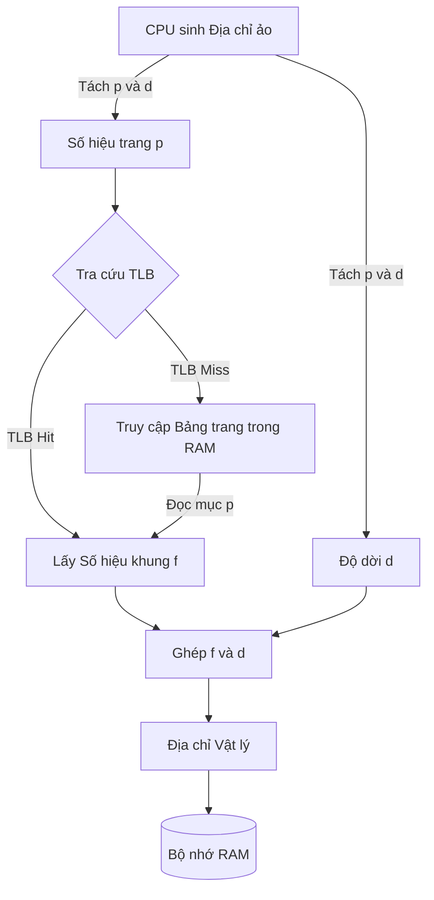

# HỆ THỐNG KIẾN THỨC QUẢN LÝ BỘ NHỚ - CHƯƠNG 7

## 1. Bản chất của Cơ chế phân trang (Paging)
* **Khung trang (Frame):** Chia bộ nhớ vật lý (RAM) thành các khối cố định (kích thước là lũy thừa của 2).
* **Trang (Page):** Chia không gian địa chỉ ảo của tiến trình thành các khối bằng hệt Frame.
* **Ưu điểm:** Giải quyết triệt để **Phân mảnh ngoại (External Fragmentation)** vì tiến trình không cần nạp vào các vùng nhớ liên tục.
* **Nhược điểm:** Gây ra **Phân mảnh nội (Internal Fragmentation)** ở trang cuối cùng nếu tiến trình không lấp đầy trang đó.

## 2. Công thức Dịch địa chỉ (Address Translation)
Giả sử hệ thống có không gian địa chỉ ảo là $2^m$ bit, kích thước trang là $2^n$ byte.
* **Độ dời trang (Offset - $d$):** Cần $n$ bit. Giữ nguyên không đổi khi chuyển từ Ảo sang Vật lý.
* **Số hiệu trang ($p$):** Chiếm $m - n$ bit trong địa chỉ ảo.
* **Số hiệu khung ($f$):** Số bit phụ thuộc vào dung lượng RAM thực tế.
* **Số mục của Bảng trang (PTEs):** $2^{m-n}$ mục.

## 3. Thời gian truy xuất hiệu dụng (EAT) với TLB
TLB (Translation Look-aside Buffer) là cache phần cứng siêu tốc để lưu cặp (Page, Frame).
* $EAT=(\epsilon+x)\alpha+(\epsilon+2x)(1-\alpha)=(2-\alpha)x+\epsilon$
* $\epsilon$: Thời gian tra cứu TLB.
* $x$: Thời gian truy cập bộ nhớ vật lý (RAM).
* $\alpha$: Tỉ lệ Hit-ratio của TLB.

## 4. Bảo vệ & Chia sẻ bộ nhớ
* **Protection Bits:** `read-only`, `read-write`, `execute-only` được gắn vào mỗi mục trong bảng trang.
* **Valid/Invalid Bit:** * `Valid`: Trang thuộc về tiến trình.
  * `Invalid`: Truy cập trái phép, tạo ra lỗi (Trap to OS).
* **Chia sẻ (Sharing):** Các bảng trang của nhiều tiến trình có thể cùng trỏ về một khung trang vật lý (thường dùng cho code `read-only`).

## 5. Sơ đồ Dịch địa chỉ của MMU (Mermaid)

